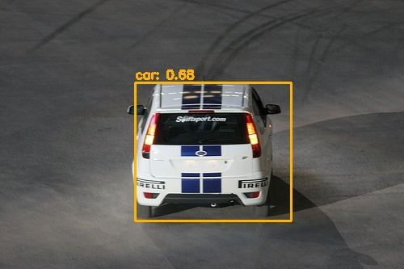
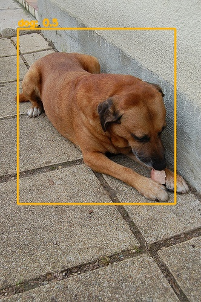
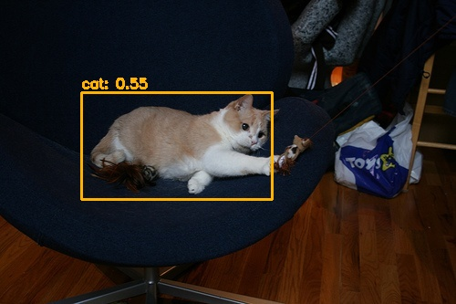

# YOLOV1-PYTORCH
  A minimal PyTorch implementation of Yolov1, with support for training, inference and evaluation.
 
# Desc
  The model is trained only little epochs. so detect result not so good ! 
  
# Result

